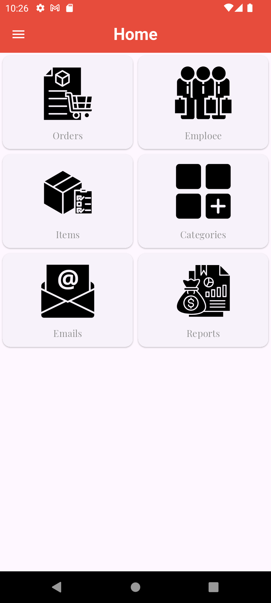
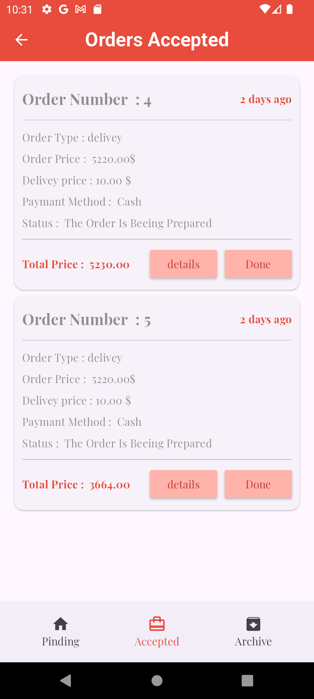

# 🛒 E-Commerce App  
A modern and feature-rich e-commerce application built using **Flutter** for the frontend and **PHP/MySQL** for the backend.

## ✨ Key Features

- **Admin Panel** 👨💼
  - Add/Edit/Delete categories
  - Manage products inventory
  - Accept/Cancel orders
  - Track order statistics

## 📸 Screenshots

  
  
  
  
  
  
  

## 🛠️ Tech Stack
- **Frontend**:  
    
  

- **Backend**:  
    
  

## 🚀 Implementation Details
- **User-Friendly Interface**: Clean and intuitive UI for easy shopping
- **Secure Authentication**: Email and Google sign-in for quick access
- **Admin Privileges**: Role-based access control for admin operations
- **Real-Time Order Tracking**: Stay updated on order progress
- **Inventory Management**: Add/Edit products and categories dynamically

